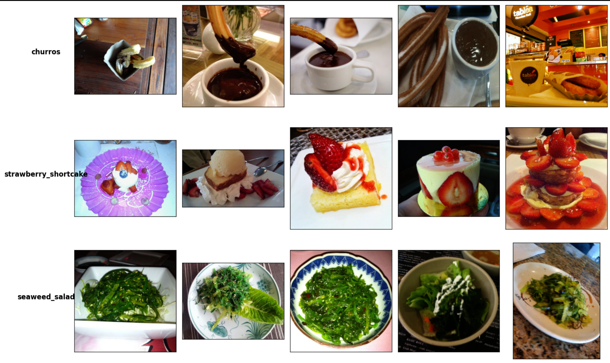
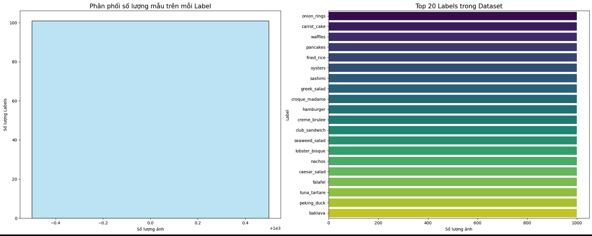
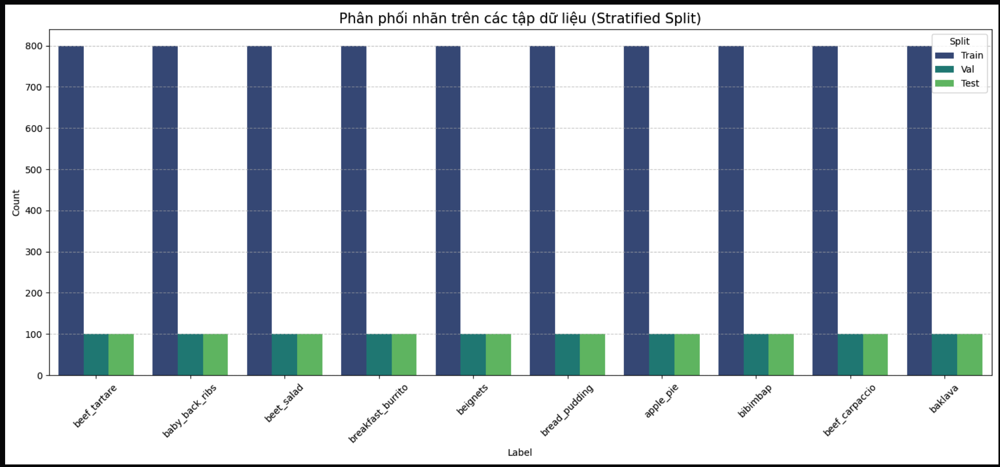
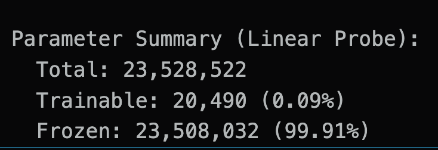
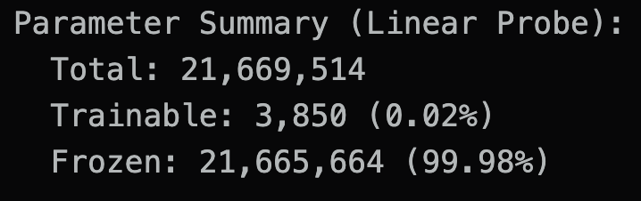
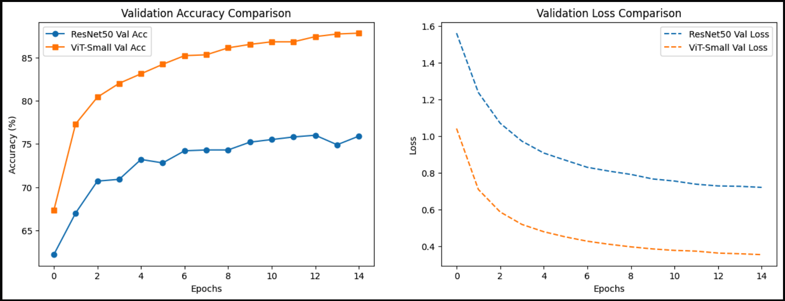
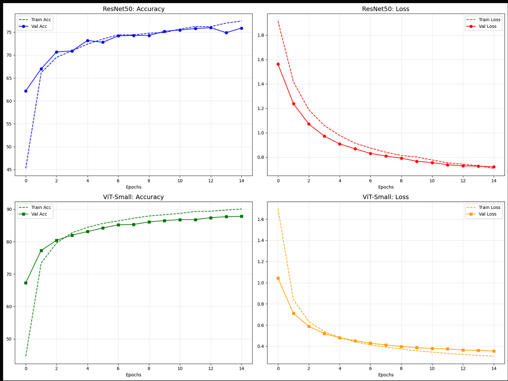
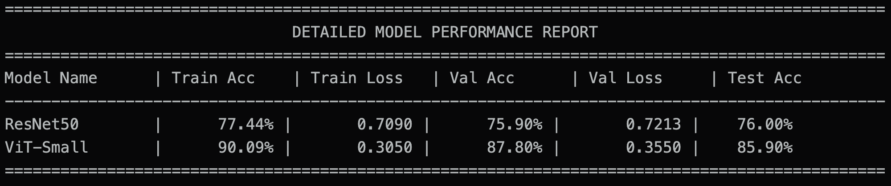

## Assignment 1: Image Classification

Dataset: [Food-101](https://www.kaggle.com/datasets/dansbecker/food-101)

This document summarizes the workflow implemented in [source/assignment_1/image/image.ipynb](source/assignment_1/image/image.ipynb).

## Exploratory Data Analysis (EDA)

The notebook first validates dataset structure after downloading from Kaggle, then performs quick visual inspection and descriptive analysis:

- Random sample visualization by class (`visualize_samples`)
- Label-wise sample counting (`analyze_dataset`)
- Distribution plots with histogram and bar charts (`visualize_dataset_stats`)

## Data Preparation

For faster experimentation, the workflow trains on 10 selected labels.

- Build `ImageFolder` from `images/`
- Filter indices for 10 labels
- Stratified split: 80% train, 10% validation, 10% test
- Apply transforms:
  - `Resize(224, 224)`
  - `ToTensor()`
  - ImageNet normalization
- Create DataLoaders for train/val/test

This keeps class balance across splits and provides a consistent pipeline for both models.

## Model Summary

Two transfer-learning models are trained and compared:

### 1. ResNet Branch
- Pretrained ResNet backbone
- Classification head replaced by `Linear(..., 10)`
- Backbone frozen for linear probing

### 2. ViT Branch
- Pretrained Vision Transformer from `timm`
- Classification head replaced by `Linear(..., 10)`
- Backbone frozen for linear probing

Both branches print trainable vs frozen parameter counts before training.

## Training Settings

Training is managed by a shared `Trainer` class.

- Loss: Cross-Entropy Loss
- Optimizer: Adam (`lr=1e-4`)
- Metrics tracked each epoch:
  - train loss / train accuracy
  - validation loss / validation accuracy
- Checkpoint rule: keep best weights based on validation loss
- Safety stop: if validation loss increases versus previous epoch, trigger early emergency stop

The notebook trains both branches sequentially and saves best checkpoints.

<!-- TODO: Insert figure - training curves (loss and accuracy) -->

## Results & Comparison

The notebook compares both models using:

- Validation curves (accuracy and loss)
- Final test accuracy
- Consolidated comparison table (`final_comparison`, `final_comparison_v2`)

This provides a direct baseline comparison between CNN-based and Transformer-based image classifiers on the same 10-label subset.

