## Assignment 1: Multimodal classification

Dataset: [UPMC Food-101
](https://www.kaggle.com/datasets/gianmarco96/upmcfood101)

[VISIIR](https://visiir.isir.upmc.fr/)

> For this project, we created the UPMC Food-101 dataset. This dataset contains 101 food categories. For each of them constituted, we gathered around 800 to 950 images from a Google Image seach of the title of the category. Because of this, this dataset may contain some noise. 

### Exploratory Data Analysis (EDA)

The dataset consists of food images, title text, and their corresponding 101 categories. Let's take a look at the data structure.

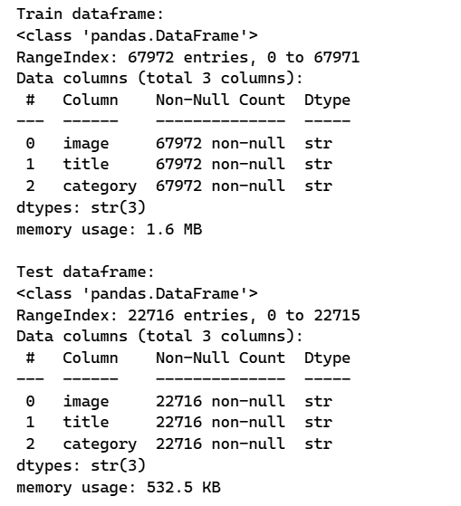
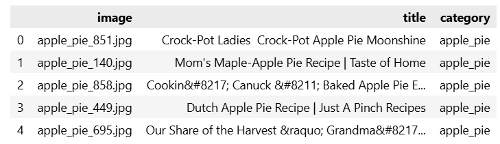

The images are organized into 101 distinct classes.

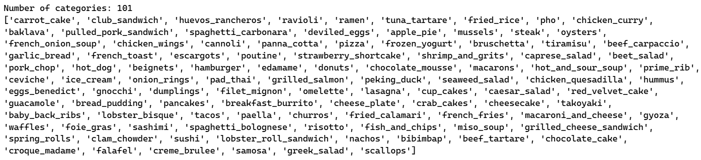
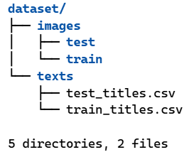

#### Class Distribution
Visualizing the category distribution shows the class imbalance across the training set:

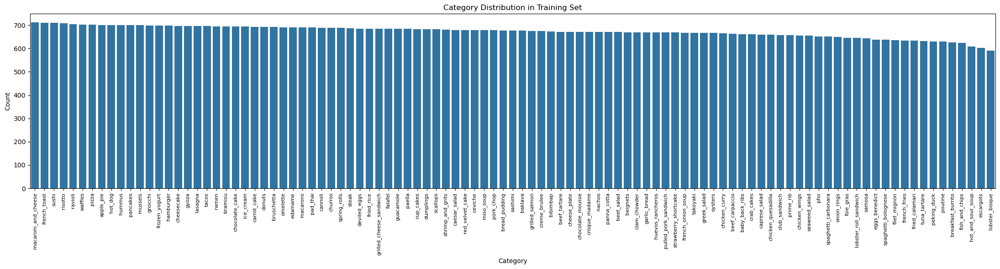

#### Title Length Analysis
Analyzing the word counts of the text titles shows the distribution in the dataset:

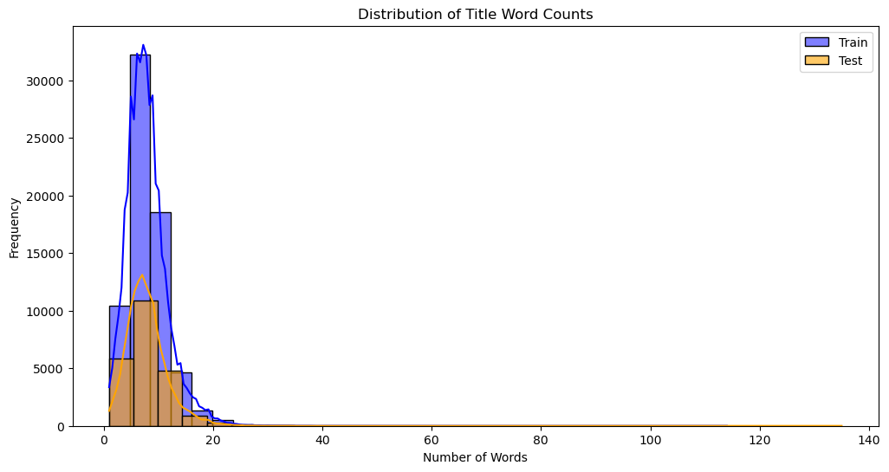

#### Sample Images
Visualizing some sample images paired with their categories and text titles:

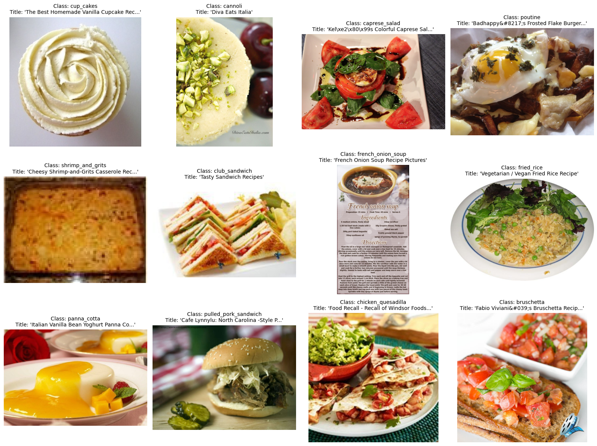

#### Image Dimensions
Checking the image sizes across a sample:

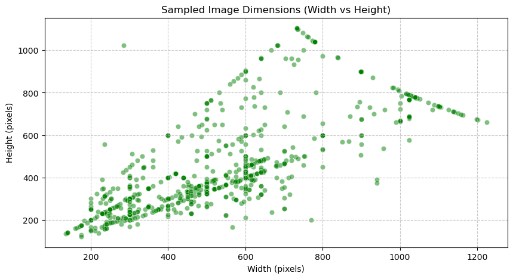

### Model Approaches

In this dataset, each sample contains:
* An image (picture of food)
* A text (title)
* A class (category)

We test two different classification approaches using the pre-trained CLIP model (`openai/clip-vit-base-patch32`):

#### Approach 1: Zero-shot
We encode the 101 classes into text prompts styled as "A photo of {class}". For each sample, the model passes the image through the image encoder. It then uses Cosine similarity with the 101 text features to find the best match. This relies entirely on CLIP's pre-trained knowledge. It does not use the title text and requires no training.

**Results:**
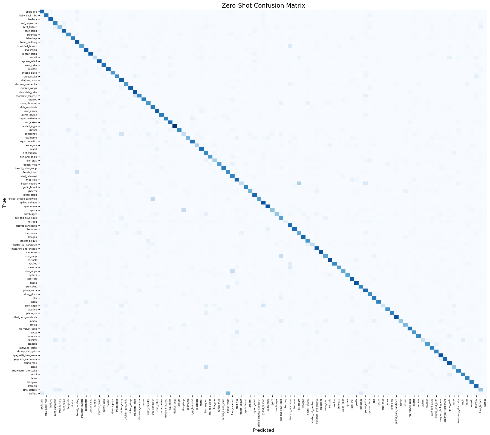
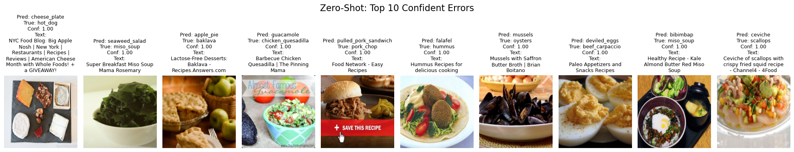

#### Approach 2: Few-shot Multimodal MLP
For each sample, we pass the image into the CLIP image encoder and the specific sample text (title) into the CLIP text encoder to get both embeddings (512-dim each). These embeddings are concatenated, forming a 1024-dim vector, and passed through a custom Multi-Layer Perceptron (MLP) with a ReLU and Dropout layer to generate the 101-class output logits. This model is trained explicitly using the text, image, and class labels.

**Training Progress:**
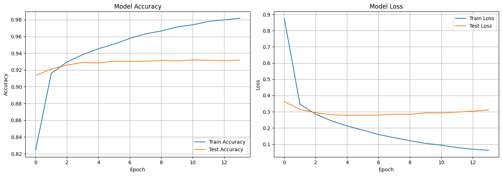

**Results:**
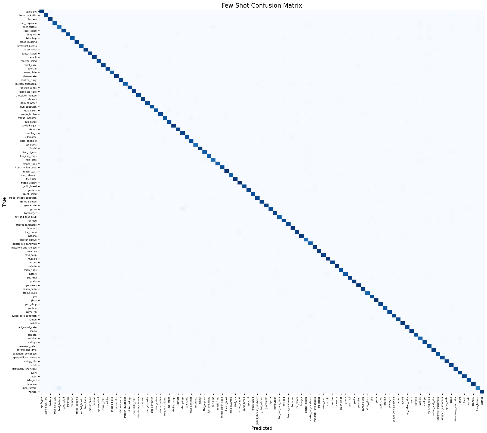
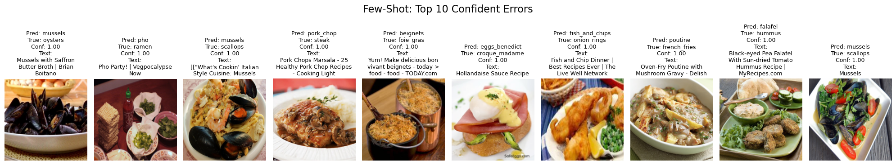

### Comprehensive Insights and Analysis

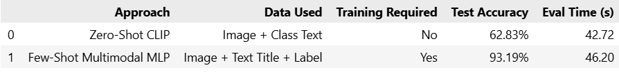

We evaluated two core capabilities of the CLIP base model:
1. **Zero-shot**: Directly compared image embeddings to the texts "A photo of {class}" via Cosine Similarity, yielding base capabilities.
2. **Few-shot Multimodal MLP**: Jointly passed Image embeddings & Text embeddings from the titles into an MLP and trained it. This approach leverages text features unique for each sample and fits to the specific UPMC dataset.

Analysis

* **Multimodal Synergy:** The Few-Shot Multimodal MLP approach demonstrates the power of combining textual and visual modalities. While the Zero-Shot approach relies solely on generic pre-trained visual-semantic alignments, the Few-Shot model capitalizes on the specific context provided by the image titles. Even with some dataset noise, the texts often include explicit dish names, ingredients, or descriptive adjectives that help disambiguate visually similar food classes.
* **Impact of Dataset Noise:** As noted in the dataset description, the images and titles were gathered via web search, inherently introducing noise. The trained MLP classification head helps the model adapt to this domain-specific noise distribution, learning to properly weigh the fused text and image embeddings for these 101 specific classes. In contrast, the rigid Zero-Shot model lacks this adaptive capability.
* **Error Patterns:** Analysis of the top errors reveals that models generally struggle with fine-grained classification where inter-class variance is low. Foods with high visual similarity (e.g., distinguishing between different types of visually similar cakes, salads, or sandwiches) commonly confuse the image encoder. In the Few-Shot model, misleading or entirely irrelevant text titles can also forcefully drive highly confident misclassifications, showing the model's reliance on text cues.
* **Efficiency vs. Accuracy Trade-off:** The Zero-Shot approach provides an immediate baseline capability utilizing CLIP's vast pre-trained knowledge with zero training cost. However, to maximize accuracy for a specialized task like recognizing 101 local food categories, investing computational resources to train a lightweight fusion module (the multimodal MLP) proves highly effective and necessary.

