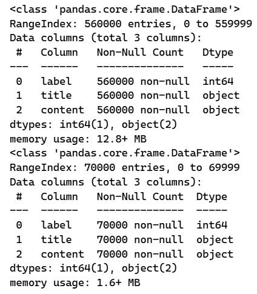
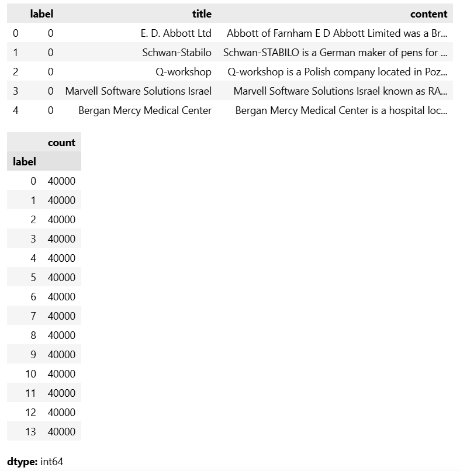
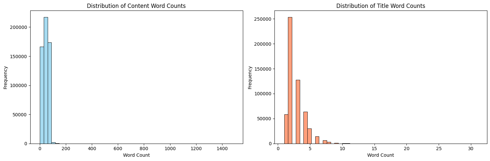
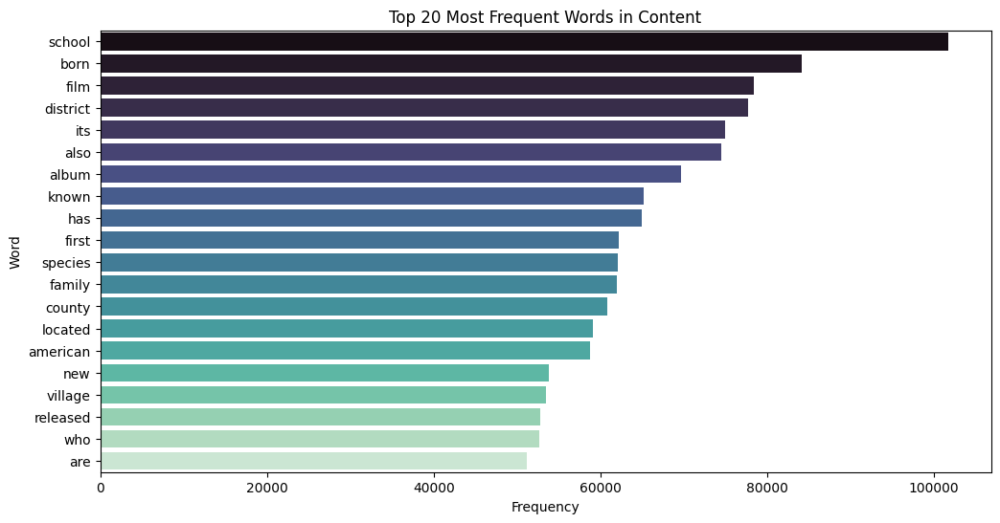
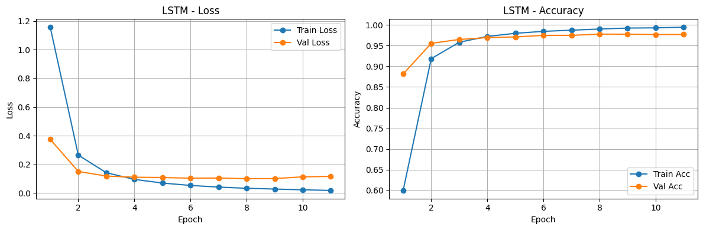
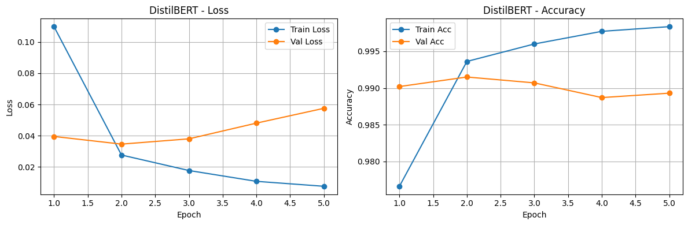
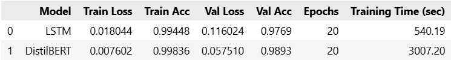

## Assignment 1: Text classification

Dataset: [DBpedia Ontology](https://www.kaggle.com/datasets/thedevastator/dbpedia-ontology-dataset)

> The DBpedia Ontology Classification Dataset, known as dbpedia_14, is a comprehensive and meticulously constructed dataset containing a vast collection of text samples. These samples have been expertly classified into 14 distinct and non-overlapping classes.  
> Each text sample include a title, which succinctly summarizes the main topic or subject matter of the text sample, and content that comprehensively covers all relevant information related to a specific topic.

https://www.unitxt.ai/en/main/catalog/catalog.cards.dbpedia_14.html

```json
{
    0: "Company",
    1: "Educational Institution",
    2: "Artist",
    3: "Athlete",
    4: "Office Holder",
    5: "Mean Of Transportation",
    6: "Building",
    7: "Natural Place",
    8: "Village",
    9: "Animal",
    10: "Plant",
    11: "Album",
    12: "Film",
    13: "Written Work",
}
```

## Exploratory Data Analysis (EDA)

We begin by inspecting the dataset structure and basic statistics:



To understand the class distribution, we visualize the counts of each label, ensuring there is a balanced representation across all 14 categories:



Next, we evaluate the length of the text data by analyzing the distribution of word counts in both the titles and content sections:



We also extract and visualize the most frequent words found in the content to gain insight into the common vocabulary used throughout the dataset:



## Data Preparation

For faster experimentation and training efficiency in this assignment, a subset of the data is randomly sampled (50,000 samples for training, 10,000 for testing). 

We use the `distilbert-base-uncased` tokenizer from Hugging Face (`DistilBertTokenizerFast`) to tokenize the text sequence, ensuring a maximum sequence length of 128 tokens. Special tokens are added, texts are padded to `max_length`, and truncated appropriately to maintain fixed-size input tensors.

## Model Summary

We compare two different neural network architectures for text classification:

### 1. LSTM Classifier
A recurrent neural network leveraging the context of word sequences.
*   **Embedding Layer**: Maps the vocabulary size into 128-dimensional dense vectors.
*   **LSTM Layer**: A Bidirectional LSTM architecture with a hidden state dimension of 256.
*   **Dense Layer**: A fully connected feed-forward layer for 14-class prediction, preceded by a Dropout layer (prob. 0.3) for regularization.

### 2. DistilBERT Classifier
A Transformer-based architecture known for powerful natural language understanding.
*   **Backbone**: A pretrained `distilbert-base-uncased` model.
*   **Classification Head**: An added fully connected Linear layer interpreting the pooled output (from the `[CLS]` token position) predicting 14 classes, with Dropout (0.3).

## Training Settings

*   **Loss Function**: Cross-Entropy Loss (`nn.CrossEntropyLoss`). 
*   **Optimizer**: Adam with learning rates finely tuned for each model:
    *   LSTM: `1e-3`
    *   DistilBERT: `2e-5` (to not override pre-trained weights aggressively)
*   **Epochs & Regularization**: Trained for 20 epochs with early stopping implemented (loss patience = 3).
*   **Batch Size**: 32 for both training and valid sets.

## Results & Comparison

The training and validation curves demonstrating Loss and Accuracy over epochs for both the LSTM and DistilBERT models are shown below:




Finally, we comprehensively evaluate the performance of both models after training. The comparison table below highlights training times, final losses, and evaluation metrics, demonstrating the distinct trade-offs between an efficient bidirectional RNN architecture and a more parameter-heavy but robust transformer mode like DistilBERT.



## Insights & Discussion

Based on the data exploration and the comparative training results of the two models, we can draw the following key insights:

1. **Pre-trained Knowledge vs. Training from Scratch**: DistilBERT leverages massive pre-training, allowing it to understand deep contextual relationships and semantics right out of the box. This predictably results in higher accuracy and faster convergence (in fewer epochs) compared to the LSTM model, which must learn embeddings and sequence representations entirely from the restricted training sample.
2. **Computational Trade-offs**: While DistilBERT achieves superior predictive performance, it demands significantly more computational power, memory, and vRAM. The LSTM model is much lighter and faster to train per epoch. This makes the LSTM a highly viable baseline for resource-constrained environments or real-time applications where strict inference budgets are prioritized over state-of-the-art accuracy.
3. **Information Density & Sequence Length**: Our EDA showed the distribution of word counts across the dataset. By employing a maximum sequence length of 128 tokens for the DistilBERT model, we effectively capture the most vital predictive information (which is typically front-loaded in encyclopedic DBpedia articles). This approach balances memory footprint without drastically sacrificing context.
4. **Regularization & Generalization**: Exploring a powerful Transformer model alongside a Bidirectional LSTM on a sampled subset (50,000 rows) highlights the risk of overfitting. The inclusion of aggressive Dropout layers (`p=0.3`) and patience-based Early Stopping were crucial in ensuring both models could gracefully halt training and generalize to the unseen test set, rather than simply memorizing the training data across the 20 epochs.


