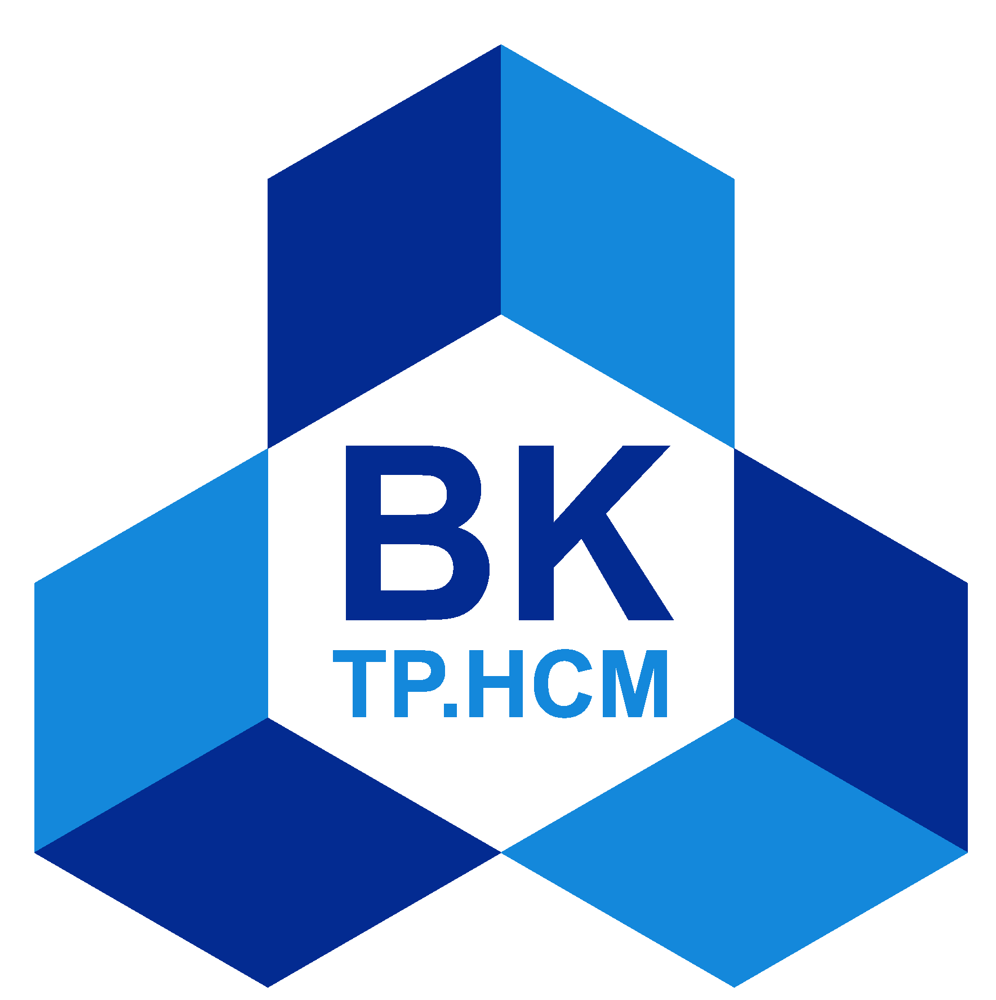

# Deep learning and its applications (CO3133) - Assignment HK252

> **Source:** [GitHub](https://github.com/phamtranminhtri/deep_learning_assignment)

Ho Chi Minh City University of Technology (HCMUT) – Vietnam National University-Ho Chi Minh City (VNU-HCMC).

Deep learning and its applications (CO3133) assignments, group A01, team 8386.

## General information

- **Course name:** Deep learning and its applications (CO3133).
- **Semester:** 252
- **Academic year:** 2025-2026.
- **Instructor:** Lê Thành Sách, email: ltsach@hcmut.edu.vn.
- **Team:** 8386
- **Team members:**

  | Name               | Student ID | Email address                   |
  |--------------------|------------|---------------------------------|
  | Lê Nguyễn Kim Khôi   | 2311671    | khoi.lenguyenkim@hcmut.edu.vn    |
  | Phạm Trần Minh Trí | 2313622    | tri.phamtranminh@hcmut.edu.vn   |

## Assignment 1

Main page: [Assignment 1](assignment_1/index.md)

## Assignment 2

To do.

## Assignment 3

To do.